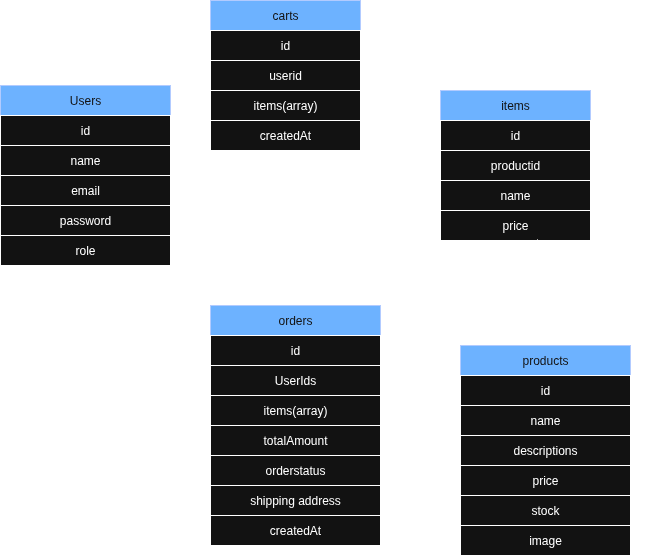
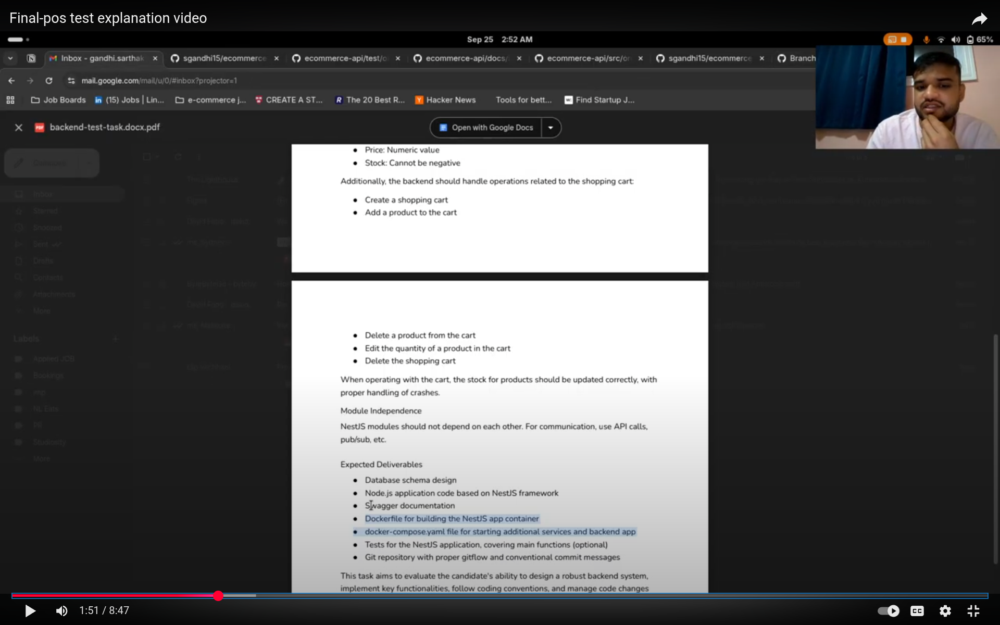

> NOTE: fixed problem with e2e tests by using randomUUID from crypto module instead of uuid library and also changed connection string in env example so that it works with docker compose

## EDIT: To run tests in running containers

- navigate to `ecommerce-api` directory
- run `docker exec -t -i ecommerce-nest-api /bin/bash` to get into the container
- run `npm run test:e2e` to run the tests

---

## Project Setup

1. Clone the repository
2. copy .env.example to .env and you dont need to change anything
3. run `docker compose up -d` to start the containers
4. Navigate to `http://localhost:8081` to access the mongo express admin panel
5. Navigate to `http://localhost:3000/api` to access the swagger documentation

## Things I did

1. Used mongodb as the database
   - used mongoose as the odm
2. simple git workflow
   - used branches by feature like `feature/auth`, `feature/docker`
3. Wrote 2 e2e tests
   - user auth flow e2e test
   - order creation flow e2e test
4. Project specifications
   1. Dockerized the app
   2. Docker-compose file
   3. Environment variables
   4. Swagger documentation
   5. Auth and User module
   6. Carts module
   7. Products module
   8. Orders module

---

## And here is the initial db design

---

## And instead of me making you read through the code and you trying to understand what I did for each feature, I will show you the video demo

click the image to watch the video

---

# E-Commerce API - Technical Documentation

## Project Overview

This is a comprehensive e-commerce API built with **NestJS**, featuring a modern microservices-inspired architecture with event-driven communication, comprehensive testing, and containerized deployment.

### Database & ODM

- **MongoDB** - Document database
- **Mongoose** - MongoDB object modeling

**Why MongoDB + Mongoose?**

- Schema flexibility for evolving product catalogs
- Mongoose provides schema validation and middleware hooks
- Easy horizontal scaling for growing businesses

### Authentication & Security

- **JWT (JSON Web Tokens)** - Stateless authentication
- **bcrypt** - Password hashing
- **Custom AuthGuard** - Route protection
- **Role-based access control** (User/Admin roles)
- Request sanitization with ValidationPipe
- Input validation with class-validator

### Event-Driven Architecture

- **@nestjs/event-emitter** - Internal event system
- **Custom RequestResponseService** - Pub/Sub pattern implementation
- **Decoupled module communication** - Services communicate via events

### Testing Strategy

- **Jest** - Testing framework
- **Supertest** - HTTP assertion library for E2E tests
- **Custom test helpers** - Reusable authentication and setup utilities
- **Comprehensive E2E coverage** - Full user flows tested

**Testing Philosophy:**

- **E2E over unit tests** for API validation
- **Real database integration** tests with cleanup
- **Authentication flow validation**
- **Error scenario coverage**
- **Helper functions** for test maintainability

### Containerization & Deployment

- **Docker** - Application containerization
- **Docker Compose** - Multi-service orchestration
- **MongoDB container** - Database in container
- **Mongo Express** - Database admin interface
- **Health checks** - Service monitoring

### API Documentation

- **Swagger/OpenAPI 3.0** - Interactive API documentation
- **Automatic generation** from TypeScript decorators

## Development Approach Analysis

### Phase 1: Foundation Setup

**Approach:** Infrastructure-first development

- Started with containerization setup (Docker, Docker Compose)
- Added configuration management early
- Set up API documentation framework
- Established development environment

### Phase 2: Core User Management

**Approach:** User-centric development

- Built authentication system as foundation
- Implemented CRUD operations systematically
- Added validation and security early
- Included pagination for scalability

### Phase 3: Authentication & Authorization

**Approach:** Security-first implementation

- JWT-based authentication
- Role-based access control
- Guard implementation for route protection

### Phase 4: Product Management

**Approach:** Admin-controlled inventory

- Admin-only product creation/modification
- Complete CRUD operations
- Schema validation for product data

### Phase 5: Shopping Cart

**Approach:** User-centric shopping experience

- Cart as separate domain
- Item management within carts
- Comprehensive cart operations

### Phase 6: Order Processing

**Approach:** Event-driven order processing

- Event emitter integration
- Order lifecycle management
- Integration with cart system

### Phase 7: Event-Driven Refactoring

**Approach:** Architectural evolution

- Migrated to event-driven architecture
- Improved module decoupling
- Enhanced scalability preparation

### Phase 8: Testing & Quality Assurance

**Approach:** Comprehensive testing strategy

- E2E testing for critical user flows
- Test helpers for maintainability
- Best practices implementation
